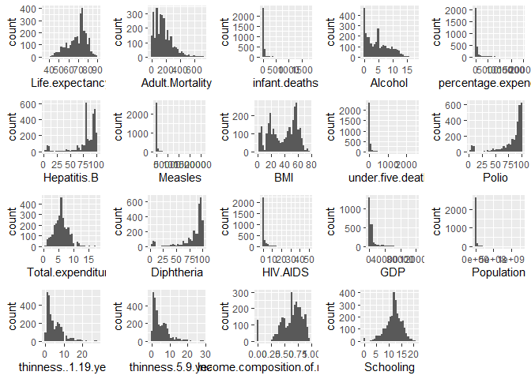
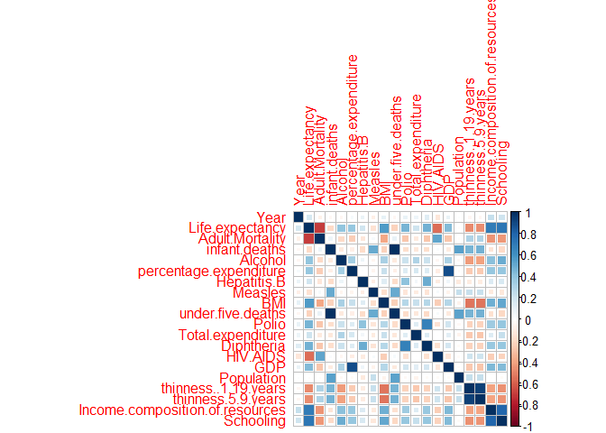
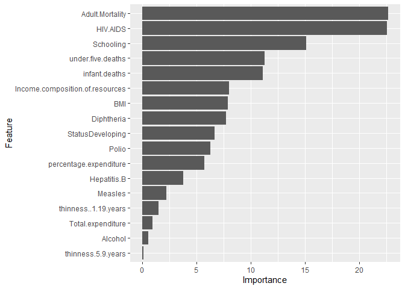

-   [Spis treści](#spis-treści)

### Spis treści

1.  [Podsumowanie analizy danych](#1)
2.  [Wykorzystane biblioteki](#2)
3.  [Wczytanie danych z pliku](#3)
4.  [Opis pliku wejściowego](#4)
5.  [Czyszczenie i przetwarzanie brakującyhc danych](#5)
6.  [Analiza atrybutów](#6)
7.  [Korelacja między atrybutami](#7)
8.  [Interaktywny wykres](#8)
9.  [Zapewnienie powtarzalności + Regresor](#9)
10. [Analiza ważności atrybutów](#10)

\#<a name="1"></a> \# Posumowanie analizy zbioru danych

Celem tego projektu jest prezentacja danych o przwidywanej długości
życia ludzi w poszczególnych krajach świata. Dane zbierane były w latach
2000 - 2015 przez przedstawicieli WHO (World Health Organization). Zbiór
danych zawiera m. in. dane o umieralności dzieci i dorosłych, odsetku
szczepień wykonywanych, czy danych ekonomicznych w poszczególnych
krajach.

Zbiór danych dostępny pod adresem:
<a href="https://www.kaggle.com/kumarajarshi/life-expectancy-who" class="uri">https://www.kaggle.com/kumarajarshi/life-expectancy-who</a>
\#<a name="2"></a> \# Wykorzystane biblioteki

``` r
library(plotly)
library(caret)
library(ggplot2)
library(dplyr)
library(gridExtra)
library(corrplot)
library(knitr)
library(tidyr)
```

\#<a name="3"></a> \# Wczytanie danych z pliku

Wczytanie danych z pliku. Za pomocą heurystyki wyznaczam typy danych.

``` r
file_data <- read.table("data.csv", sep = ',', comment.char = "", na.strings = 'NA', header = TRUE)
column_datatypes <- sapply(file_data, class)
raw_data <- read.table("data.csv", sep = ',', comment.char = "", na.strings = 'NA', header = TRUE, colClasses = column_datatypes)
```

Załadowano 2914 wierszy, które mają 22 kolumny.

\#<a name="4"></a> \# Opis pliku wejściowego

<table>
<colgroup>
<col style="width: 35%" />
<col style="width: 64%" />
</colgroup>
<thead>
<tr class="header">
<th>Atrybut</th>
<th>Opis</th>
</tr>
</thead>
<tbody>
<tr class="odd">
<td>Country</td>
<td>Kraj przeprowadzania badań</td>
</tr>
<tr class="even">
<td>Year</td>
<td>Rok w którym zbierano dane</td>
</tr>
<tr class="odd">
<td>Status</td>
<td>Oznaczenie kraju (rozwinięty lub rozwijający się)</td>
</tr>
<tr class="even">
<td>Life expectancy</td>
<td>Przewidywana średnia długość życia</td>
</tr>
<tr class="odd">
<td>Adult Mortality</td>
<td>wskaźnik umieralności u dorosłych, obojga płci między 15 a 60 rokiem życia na 1000 osób populacji</td>
</tr>
<tr class="even">
<td>infant deaths</td>
<td>liczba zgonów niemowląt na 1000 osób populacji</td>
</tr>
<tr class="odd">
<td>Alcohol</td>
<td>zarejestrowana średnia ilość w litrach czystego alkoholu</td>
</tr>
<tr class="even">
<td>percentage expenditure</td>
<td>wydatki na zdrowie, procent PKB</td>
</tr>
<tr class="odd">
<td>Hepatitis B</td>
<td>procentowa ochrona szczepienna przeciwko WZW B wśród dzieci w wieku 1 roku</td>
</tr>
<tr class="even">
<td>Measles</td>
<td>Liczba zgłoszonych zachorowań na Odrę na 1000 osób</td>
</tr>
<tr class="odd">
<td>BMI</td>
<td>średni wskaźnik BMI w całej populacji</td>
</tr>
<tr class="even">
<td>under-five deaths</td>
<td>liczba zgonów dzieci poniżej 5 roku życia na 1000 osób</td>
</tr>
<tr class="odd">
<td>Polio</td>
<td>Procent szczepień przeciwko Polio wśród 1-latków</td>
</tr>
<tr class="even">
<td>Total expenditure</td>
<td>Odsetek całkowitych wydatków na zdrowię przez instytucje rządowe i samorządowe</td>
</tr>
<tr class="odd">
<td>Diphtheria</td>
<td>Procent szczepień przeciwko krztuścowi wśród dzieci w wieku 1 roku</td>
</tr>
<tr class="even">
<td>HIV/AIDS</td>
<td>zgony na HIV/AIDS na 1000 osób populacji</td>
</tr>
<tr class="odd">
<td>GDP</td>
<td>PKB na mieszkańca w USD</td>
</tr>
<tr class="even">
<td>Population</td>
<td>Populacja kraju</td>
</tr>
<tr class="odd">
<td>thinness 1-19 years</td>
<td>Procent występowania niedowagi wśród dzieci w wieku 1-19 lat</td>
</tr>
<tr class="even">
<td>thinness 5-9 years</td>
<td>Procent występowania niedowagi wśród dzieci w wieku 5-9</td>
</tr>
<tr class="odd">
<td>Income composition of</td>
<td>Wskaźnik rozwoju społecznego pod względem struktury dochodów w zakresie zasobów (wskaźnik od 0 do 1)</td>
</tr>
<tr class="even">
<td>Schooling</td>
<td>Liczba lat nauki</td>
</tr>
</tbody>
</table>

\#<a name="5"></a> \# Czyszczenie danych, uzupełnienie brakujących
wartości

``` r
data_without_na_in_life_expectancy  <-  (raw_data[!is.na(raw_data$Life.expectancy),])
dim(data_without_na_in_life_expectancy)
for(i in 1:ncol(data_without_na_in_life_expectancy)){
  data_without_na_in_life_expectancy[is.na(data_without_na_in_life_expectancy[,i]), i] <- mean(as.numeric(data_without_na_in_life_expectancy[,i]), na.rm = TRUE)
}
clean_data <-data_without_na_in_life_expectancy
```

Proces czyszczenia danych składał się z dwóch faz: 1) usunięcie rekordów
zawierających wartości puste w kolumnie Life expectancy, 2) Wartości
puste z pozostałych kolumn zastąpione zostały średnią z poszczególnych
kolumn.

Usunięcie wszystkich rekordów które zawierały wartości puste nie było
możliwe, ze względu na to iż stracilibyśmy około 40% rekordów.

\#<a name="6"></a> \# Analiza atrybutów + rozkłady wartości atrybutów

``` r
summary(clean_data)
```

    ##                 Country          Year             Status     Life.expectancy
    ##  Afghanistan        :  16   Min.   :2000   Developed : 512   Min.   :36.30  
    ##  Albania            :  16   1st Qu.:2004   Developing:2392   1st Qu.:63.20  
    ##  Algeria            :  16   Median :2008                     Median :72.15  
    ##  Angola             :  16   Mean   :2007                     Mean   :69.29  
    ##  Antigua and Barbuda:  16   3rd Qu.:2011                     3rd Qu.:75.70  
    ##  Argentina          :  16   Max.   :2015                     Max.   :89.00  
    ##  (Other)            :2808                                                   
    ##  Adult.Mortality infant.deaths        Alcohol       percentage.expenditure
    ##  Min.   :  1.0   Min.   :   0.00   Min.   : 0.010   Min.   :    0.000     
    ##  1st Qu.: 73.0   1st Qu.:   0.00   1st Qu.: 1.097   1st Qu.:    5.593     
    ##  Median :143.0   Median :   3.00   Median : 4.185   Median :   67.721     
    ##  Mean   :163.9   Mean   :  30.44   Mean   : 4.625   Mean   :  746.440     
    ##  3rd Qu.:227.0   3rd Qu.:  22.00   3rd Qu.: 7.442   3rd Qu.:  448.638     
    ##  Max.   :723.0   Max.   :1800.00   Max.   :17.870   Max.   :19479.912     
    ##                                                                           
    ##   Hepatitis.B       Measles              BMI        under.five.deaths
    ##  Min.   : 2.00   Min.   :     0.0   Min.   : 1.00   Min.   :   0.00  
    ##  1st Qu.:81.12   1st Qu.:     0.0   1st Qu.:19.48   1st Qu.:   0.00  
    ##  Median :87.00   Median :    17.0   Median :43.20   Median :   4.00  
    ##  Mean   :81.12   Mean   :  2441.3   Mean   :38.38   Mean   :  42.22  
    ##  3rd Qu.:96.00   3rd Qu.:   362.2   3rd Qu.:56.10   3rd Qu.:  28.00  
    ##  Max.   :99.00   Max.   :212183.0   Max.   :77.60   Max.   :2500.00  
    ##                                                                      
    ##      Polio       Total.expenditure   Diphtheria       HIV.AIDS     
    ##  Min.   : 3.00   Min.   : 0.370    Min.   : 2.00   Min.   : 0.100  
    ##  1st Qu.:78.00   1st Qu.: 4.370    1st Qu.:78.00   1st Qu.: 0.100  
    ##  Median :93.00   Median : 5.937    Median :93.00   Median : 0.100  
    ##  Mean   :82.61   Mean   : 5.937    Mean   :82.43   Mean   : 1.749  
    ##  3rd Qu.:97.00   3rd Qu.: 7.343    3rd Qu.:97.00   3rd Qu.: 0.800  
    ##  Max.   :99.00   Max.   :17.600    Max.   :99.00   Max.   :50.600  
    ##                                                                    
    ##       GDP              Population        thinness..1.19.years
    ##  Min.   :     1.68   Min.   :3.400e+01   Min.   : 0.10       
    ##  1st Qu.:   571.43   1st Qu.:3.983e+05   1st Qu.: 1.60       
    ##  Median :  2965.48   Median :3.515e+06   Median : 3.40       
    ##  Mean   :  7494.21   Mean   :1.276e+07   Mean   : 4.84       
    ##  3rd Qu.:  7494.21   3rd Qu.:1.276e+07   3rd Qu.: 7.10       
    ##  Max.   :119172.74   Max.   :1.294e+09   Max.   :27.70       
    ##                                                              
    ##  thinness.5.9.years Income.composition.of.resources   Schooling    
    ##  Min.   : 0.100     Min.   :0.0000                  Min.   : 0.00  
    ##  1st Qu.: 1.600     1st Qu.:0.5028                  1st Qu.:10.30  
    ##  Median : 3.400     Median :0.6650                  Median :12.20  
    ##  Mean   : 4.871     Mean   :0.6277                  Mean   :12.01  
    ##  3rd Qu.: 7.200     3rd Qu.:0.7730                  3rd Qu.:14.20  
    ##  Max.   :28.600     Max.   :0.9480                  Max.   :20.70  
    ## 

``` r
summary(raw_data)
```

    ##                 Country          Year             Status     Life.expectancy
    ##  Afghanistan        :  16   Min.   :2000   Developed : 512   Min.   :36.30  
    ##  Albania            :  16   1st Qu.:2004   Developing:2402   1st Qu.:63.20  
    ##  Algeria            :  16   Median :2008                     Median :72.15  
    ##  Angola             :  16   Mean   :2008                     Mean   :69.29  
    ##  Antigua and Barbuda:  16   3rd Qu.:2012                     3rd Qu.:75.70  
    ##  Argentina          :  16   Max.   :2015                     Max.   :89.00  
    ##  (Other)            :2818                                    NA's   :10     
    ##  Adult.Mortality infant.deaths        Alcohol       percentage.expenditure
    ##  Min.   :  1.0   Min.   :   0.00   Min.   : 0.010   Min.   :    0.00      
    ##  1st Qu.: 73.0   1st Qu.:   0.00   1st Qu.: 0.860   1st Qu.:    5.45      
    ##  Median :143.0   Median :   3.00   Median : 3.790   Median :   67.69      
    ##  Mean   :163.9   Mean   :  30.33   Mean   : 4.613   Mean   :  744.33      
    ##  3rd Qu.:227.0   3rd Qu.:  22.00   3rd Qu.: 7.755   3rd Qu.:  447.50      
    ##  Max.   :723.0   Max.   :1800.00   Max.   :17.870   Max.   :19479.91      
    ##  NA's   :10                        NA's   :191                            
    ##   Hepatitis.B       Measles              BMI        under.five.deaths
    ##  Min.   : 2.00   Min.   :     0.0   Min.   : 1.00   Min.   :   0.00  
    ##  1st Qu.:77.00   1st Qu.:     0.0   1st Qu.:19.38   1st Qu.:   0.00  
    ##  Median :92.00   Median :    16.0   Median :43.80   Median :   4.00  
    ##  Mean   :81.09   Mean   :  2432.9   Mean   :38.47   Mean   :  42.07  
    ##  3rd Qu.:97.00   3rd Qu.:   360.2   3rd Qu.:56.30   3rd Qu.:  27.00  
    ##  Max.   :99.00   Max.   :212183.0   Max.   :87.30   Max.   :2500.00  
    ##  NA's   :551                        NA's   :34                       
    ##      Polio       Total.expenditure   Diphtheria       HIV.AIDS     
    ##  Min.   : 3.00   Min.   : 0.370    Min.   : 2.00   Min.   : 0.100  
    ##  1st Qu.:78.00   1st Qu.: 4.260    1st Qu.:78.00   1st Qu.: 0.100  
    ##  Median :93.00   Median : 5.760    Median :93.00   Median : 0.100  
    ##  Mean   :82.61   Mean   : 5.945    Mean   :82.43   Mean   : 1.743  
    ##  3rd Qu.:97.00   3rd Qu.: 7.500    3rd Qu.:97.00   3rd Qu.: 0.800  
    ##  Max.   :99.00   Max.   :17.600    Max.   :99.00   Max.   :50.600  
    ##  NA's   :19      NA's   :216       NA's   :19                      
    ##       GDP              Population        thinness..1.19.years
    ##  Min.   :     1.68   Min.   :3.400e+01   Min.   : 0.100      
    ##  1st Qu.:   463.94   1st Qu.:1.958e+05   1st Qu.: 1.600      
    ##  Median :  1766.95   Median :1.387e+06   Median : 3.300      
    ##  Mean   :  7483.16   Mean   :1.275e+07   Mean   : 4.829      
    ##  3rd Qu.:  5910.81   3rd Qu.:7.420e+06   3rd Qu.: 7.200      
    ##  Max.   :119172.74   Max.   :1.294e+09   Max.   :27.700      
    ##  NA's   :424         NA's   :628         NA's   :34          
    ##  thinness.5.9.years Income.composition.of.resources   Schooling   
    ##  Min.   : 0.10      Min.   :0.0000                  Min.   : 0.0  
    ##  1st Qu.: 1.50      1st Qu.:0.4930                  1st Qu.:10.1  
    ##  Median : 3.30      Median :0.6780                  Median :12.4  
    ##  Mean   : 4.86      Mean   :0.6279                  Mean   :12.0  
    ##  3rd Qu.: 7.20      3rd Qu.:0.7800                  3rd Qu.:14.3  
    ##  Max.   :28.60      Max.   :0.9480                  Max.   :20.7  
    ##  NA's   :34         NA's   :151                     NA's   :147

``` r
attr<-select(data_without_na_in_life_expectancy,-Country, -Year, -Status)
a <- list()
for (col in colnames(attr)) {
a[[col]] <-((ggplot(attr) +
    aes_string(x=col) +
    geom_histogram(bins = 30))) 
}

do.call("grid.arrange",c(a, ncol = 5))
```



\#<a name="7"></a> \# Korelacja między atrybutami

Analizę związków pomiędzy atrybutami dokonano za pomocą wizualizacji
macierzy korelacji.

``` r
corMatrix <- cor(data_without_na_in_life_expectancy %>% select(-Country, -Status),use="complete.obs")
#clases
corrplot(corMatrix, method = "square")
```



\#<a name="8"></a> \# Interaktywny wykres

``` r
wykres <- data_without_na_in_life_expectancy[1:151, ] %>% group_by(Country, Year) %>% summarise(life = Life.expectancy)

ggplotwykres <- ggplot(data = wykres, aes(wykres$Country
, wykres$life,  color=factor(wykres$life))) + 
  geom_point()+
  labs(y="Year") + 
  labs(x="Country")+
  labs("Interaktywny wykres")
ggplotly(ggplotwykres,dynamicTicks = TRUE,width = NULL, height = NULL)
```


\#<a name="9"></a> \# Zapewnienie powtarzalności, Regresor

``` r
df <- data_without_na_in_life_expectancy

rdf <- df%>% select(Life.expectancy, Status, Adult.Mortality, infant.deaths, Alcohol, percentage.expenditure, Hepatitis.B, Measles, BMI, under.five.deaths, Polio, Total.expenditure, Diphtheria, HIV.AIDS, thinness..1.19.years, thinness.5.9.years, Income.composition.of.resources, Schooling)

inTraining <- createDataPartition(y = rdf$Life.expectancy, p = .8, list = FALSE)
training_set <- rdf[inTraining, ]
testing_set <- rdf[-inTraining, ]
ctrl <- trainControl(method = "repeatedcv", number = 4,repeats = 10)
fit <- train(Life.expectancy ~ .,
                data = training_set,
                method = "lm",
                metric = "RMSE",
                trControl = ctrl)
predict<-predict(fit, newdata=testing_set)
postResample(predict,testing_set$Life.expectancy)
```

    ##      RMSE  Rsquared       MAE 
    ## 4.4216112 0.7769966 3.3310023

\#<a name="10"></a> \# Analiza ważnosci atrybutów

``` r
modelValues <- data.frame(obs = testing_set$Life.expectancy, pred = predict)

importance <- varImp(fit, scale = FALSE)
ggplot(importance)
```



Powyższy rozkład cech w regresorze wskazał na znaczące powiązanie
długości życia do wskaźnika śmiertelności u osób chorych na AIDS, oraz
odsetkiem umieralności u osób dorosłych w przedziale 15-60 lat. W
ostatnich latach choroba AIDS przestała być klasyfikowana jako choroba
śmiertelna a zaklasyfikowana została jako choroba przewlekła. Stan ten
dotyczy jednak krajów “rozwiniętych”

Korelacja cech zachorowań na AIDS oraz niskiej długości uczenszczania do
szkół powoduje brak znajomości metod antykoncepcji, co potęguje stopień
zachorowań.

Trzecim co do ważności atrybutem jest długość nauki w szkołach. Niższa
przewidywana długość życia należy do krajów rozwijających się. W tych
krajach dostęp do nauki i szkół jest ograniczony co pośrednio może
wpływać na wazność tej cechy w regresorze.

Najmniej ważnym spośród wykorzystanych cech jest niedowaga w wieku
dziecięco-młodzieńczym oraz poziom spożywanego alkoholu.
